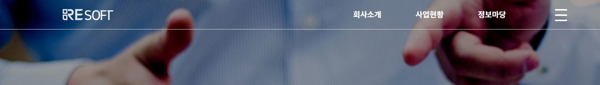
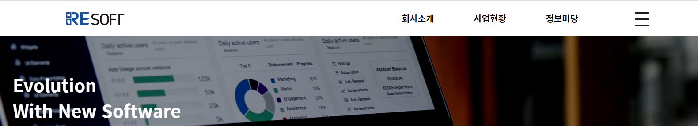
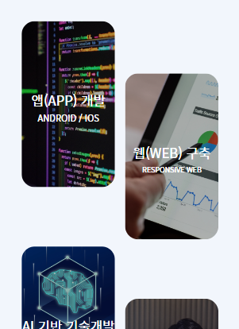

## REsoft 결과 보고서 - 3조

1. 이름: 김유민
2. 맡은 부분 : Main 페이지 - header, project, service, footer 부분
3. 다르게 한 부분:
* header 부분
   * position: fixed 되었을때 스크롤 이벤트를 주어, 아래로 스크롤 시 배경 및 글자 색 변경.
   
   	\downarrow
   

* service 부분
  * 해상도가 줄어들때 안의 박스들도 같이 줄어들게 width 값 조절함.
   